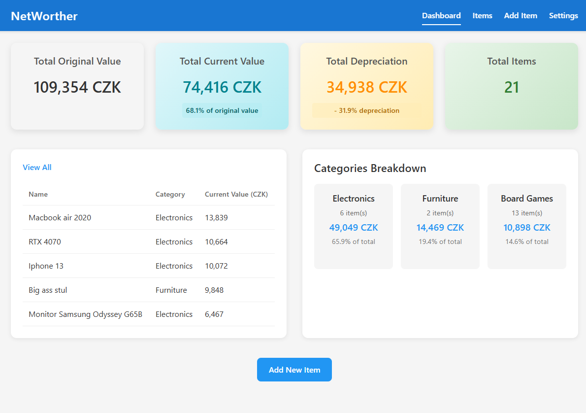

# Networther - Net Worth Calculator

A simple, vibecoded Angular application for tracking your assets and calculating your net worth. Built with a focus on simplicity, usability, and responsive design.



*This project was vibecoded using [Angular CLI](https://github.com/angular/angular-cli) version 19.1.8.and Windsurf* 

## Features

- **Asset Tracking**: Add, edit, and manage your valuable assets
- **Category Management**: Organize assets by categories (Electronics, Furniture, Vehicles, etc.)
- **Depreciation Calculation**: Automatic estimation of current value based on purchase date and category
- **Dashboard Overview**: See your total net worth, depreciation, and most valuable items at a glance
- **JSON Import/Export**: Backup and restore your data with simple JSON files
- **Responsive Design**: Works seamlessly on desktop and mobile devices
- **Multi-Item Entry**: Quickly add multiple items with the same purchase date and category
- **Custom Date Input**: User-friendly date entry with smart paste support

## Getting Started

### Development server

To start a local development server, run:

```bash
ng serve
```

Once the server is running, open your browser and navigate to `http://localhost:4201/`. The application will automatically reload whenever you modify any of the source files.

## Code scaffolding

Angular CLI includes powerful code scaffolding tools. To generate a new component, run:

```bash
ng generate component component-name
```

For a complete list of available schematics (such as `components`, `directives`, or `pipes`), run:

```bash
ng generate --help
```

## Building

To build the project run:

```bash
ng build
```

This will compile your project and store the build artifacts in the `dist/` directory. By default, the production build optimizes your application for performance and speed.

## Usage

### Adding Items

1. Navigate to the "Add Item" page
2. Fill in the item details (name, category, purchase price, purchase date)
3. The app will automatically estimate the current value based on category and age
4. Click "Add" to save the item or "Add & Continue" to add multiple items with the same date

### Managing Items

- View all your items in the "Items" page
- Edit or delete items as needed
- Sort and filter items by different properties

### Data Backup

1. Go to the "Settings" page
2. Use "Export to JSON" to save your data
3. Use "Import from JSON" to restore previously exported data

## How Depreciation Works

The app uses category-specific depreciation rates to estimate the current value of your assets:

- Electronics: 20% per year
- Furniture: 10% per year
- Vehicles: 15% per year
- Jewelry: 5% per year
- Board Games: 5% per year
- Clothing: 30% per year
- Sports Equipment: 15% per year
- Tools: 8% per year

Some categories like Collectibles (-2%) and Art (-3%) may actually appreciate in value over time.

## Local Storage

All data is stored locally in your browser using localStorage. No data is sent to any server. You can export your data as a JSON file and import it back to continue tracking your assets.
